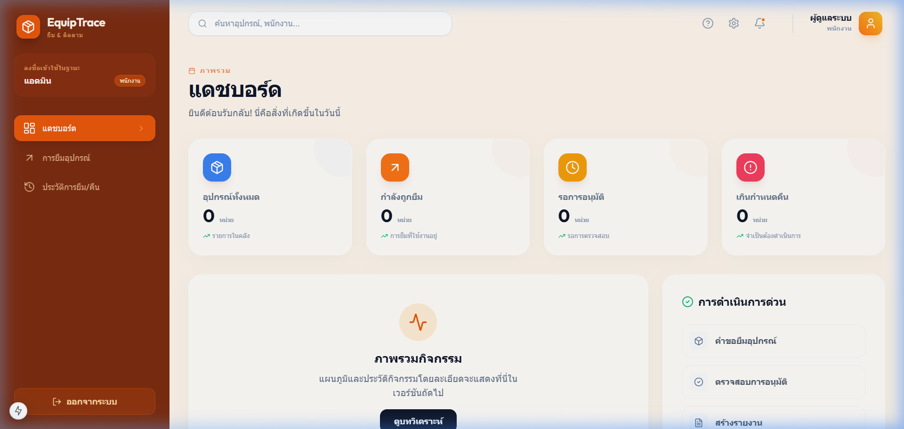

# 🏥 ระบบยืม-คืนและติดตามอุปกรณ์ (Equipment Borrow & Tracking System)

ระบบบริหารจัดการวงจรชีวิตของอุปกรณ์สำนักงานและอุปกรณ์ไอที พัฒนาด้วยเทคโนโลยีสมัยใหม่ เพื่อความรวดเร็ว แม่นยำ และประสบการณ์การใช้งานที่ยอดเยี่ยม

---

## 📸 ภาพตัวอย่างระบบ (Screenshots)

### แดชบอร์ดพรีเมียม (Premium Dashboard)

*แดชบอร์ดใหม่ที่ใช้ดีไซน์แบบ Glassmorphism พร้อมการจัดวางข้อมูลที่ชัดเจน*

---

## 🌟 คุณสมบัติหลัก (Key Features)

### 1. แดชบอร์ดอัจฉริยะ (Intelligent Dashboard)
- **สถานะแบบเรียลไทม์**: แสดงจำนวนอุปกรณ์ทั้งหมด, รายการที่ถูกยืม, คำขอที่รออนุมัติ และรายการที่เกินกำหนดคืน
- **กราฟและการวิเคราะห์**: (Coming Soon) ระบบฐานข้อมูลรองรับการเก็บสถิติเพื่อนำมาแสดงผลในรูปแบบกราฟ
- **การดำเนินการด่วน (Quick Actions)**: เข้าถึงเมนูการยืมและรายงานได้ทันทีจากหน้าแรก

### 2. การจัดการอุปกรณ์ (Equipment Management)
- **ระบบหมวดหมู่**: แบ่งกลุ่มอุปกรณ์ตามประเภท เช่น โน้ตบุ๊ก, จอภาพ, อุปกรณ์เครือข่าย
- **การติดตามสต็อก**: ควบคุมจำนวนอุปกรณ์ที่พร้อมให้ยืมและจำนวนที่มีอยู่ทั้งหมดอัตโนมัติ

### 3. ระบบผู้ใช้และสิทธิ์ (Auth & Roles)
- **Admin**: จัดการอุปกรณ์, อนุมัติการยืม-คืน, และเข้าถึงรายงานเชิงลึก
- **Staff**: สามารถส่งคำขอยืมอุปกรณ์และตรวจสอบประวัติของตนเองได้

### 4. ประวัติและการตรวจสอบ (Audit Log)
- **System Usage Logs**: บันทึกกิจกรรมทุกอย่างที่เกิดขึ้นในระบบเพื่อความปลอดภัยและการตรวจสอบย้อนหลัง

---

## 🛠️ รายละเอียดทางเทคนิค (Technical Details)

### Frontend
- **Framework**: Next.js 15 (App Router)
- **Styling**: Tailwind CSS พร้อม Custom Utility สำหรับ Glassmorphism
- **Icons**: Lucide React
- **Typography**: Outfit (Google Fonts)

### Backend
- **Framework**: ASP.NET Core 9.0 (Web API)
- **ORM**: Entity Framework Core
- **Validation**: FluentValidation (หรือเทียบเท่า)
- **Authentication**: JWT Bearer Token

### Database
- **Provider**: PostgreSQL 16
- **Schema Management**: EF Core Migrations

---

## 🚀 ขั้นตอนการติดตั้งและเริ่มใช้งาน (Full Setup Guide)

### 1. การเตรียมฐานข้อมูล (Database Setup)
หากคุณมี Docker ติดตั้งอยู่ สามารถเริ่มใช้งานฐานข้อมูลได้ทันที:
```bash
docker-compose up -d
```
*ระบบจะสร้าง Container สำหรับ PostgreSQL และ pgAdmin มาให้โดยอัตโนมัติ*

### 2. การตั้งค่า Backend
1. เปิดโปรเจกต์ใน Visual Studio หรือ VS Code
2. ไปที่ `backend/EquipmentBorrow.API`
3. แก้ไข `appsettings.json` เพื่อระบุ Connection String (หากไม่ได้ใช้ค่าเริ่มต้น)
4. เริ่มระบบ:
   ```bash
   dotnet run
   ```

### 3. การตั้งค่า Frontend
1. ไปที่โฟลเดอร์ `frontend`
2. สร้างไฟล์ `.env.local` (หากยังไม่มี) และระบุ API URL:
   ```env
   NEXT_PUBLIC_API_URL=http://localhost:5000
   ```
3. ติดตั้ง Dependencies และเริ่มระบบ:
   ```bash
   npm install
   npm run dev
   ```

---

## 📊 ผังฐานข้อมูล (Database Schema)

ระบบประกอบด้วย 6 ตารางหลักที่มีความสัมพันธ์กันดังนี้:

1. **Users**: เก็บข้อมูลผู้ใช้งานแบบ Role-based (Admin, Staff)
2. **Equipment**: ข้อมูลอุปกรณ์ทั้งหมด โดยอ้างอิงกับหมวดหมู่
3. **EquipmentCategories**: ประเภทของอุปกรณ์ (e.g. IT, Office Supply)
4. **BorrowRequests**: บันทึกการส่งคำขอยืมอุปกรณ์และสถานะการอนุมัติ
5. **ReturnRecords**: บันทึกรายละเอียดเมื่อมีการคืนอุปกรณ์กลับเข้าคลัง
6. **SystemUsageLogs**: บันทึกกิจกรรมเพื่อการตรวจสอบความปลอดภัย

---

## 📁 โครงสร้างโปรเจกต์เชิงลึก (Detailed Project Structure)

```text
Equipment-Borrow-System/
├── backend/
│   ├── EquipmentBorrow.API/   # โปรเจกต์หลักของ ASP.NET Core
│   │   ├── Controllers/       # ส่วนจัดการ API Endpoints
│   │   ├── Models/            # Entities และ DTOs
│   │   ├── Data/              # DbContext และ Seeding
│   │   └── Migrations/        # ประวัติการปรับปรุงฐานข้อมูล
├── frontend/
│   ├── app/                   # Next.js App Router (หน้าที่แสดงผล)
│   ├── components/            # UI Components (Sidebar, Header, etc.)
│   ├── lib/                   # API Utilities และ Contexts
│   └── public/                # ไฟล์ Static ต่างๆ
├── docs/                      # เอกสารประกอบการใช้งานและ Screenshots
└── README.md                  # เอกสารแนะนำโปรเจกต์ (ที่คุณกำลังอ่านอยู่)
```

---

## ❓ การแก้ไขปัญหาเบื้องต้น (Troubleshooting)

### ปัญหาเส้นทางไฟล์บน Windows (Path Issues)
หากคุณพบข้อผิดพลาด `'Tracking' is not recognized...` เมื่อสั่ง `npm run dev` ให้ใช้คำสั่งนี้แทน:
```bash
node "node_modules/next/dist/bin/next" dev -p 3001
```

### ปัญหา CORS
หาก Frontend ไม่สามารถดึงข้อมูลจาก Backend ได้ ให้ตรวจสอบไฟล์ `Program.cs` ใน Backend ว่าได้อนุญาต Origin ที่ถูกต้องแล้วหรือไม่ (ระบบเริ่มต้นอนุญาต `http://localhost:3000` และ `3001`)

---

## 🔐 ข้อมูลเข้าใช้งานเริ่มต้น (Default Accounts)
สามารถดูรายละเอียดเพิ่มเติมได้ที่ [docs/credentials.md](docs/credentials.md)

| บทบาท | Username | Password |
|---|---|---|
| Admin | `admin` | `password` |
| Staff | `staff01` | `password` |

---
*จัดทำและพัฒนาโดย Antigravity AI เพื่อประสิทธิภาพสูงสุดในการบริหารจัดการทรัพยากร*
